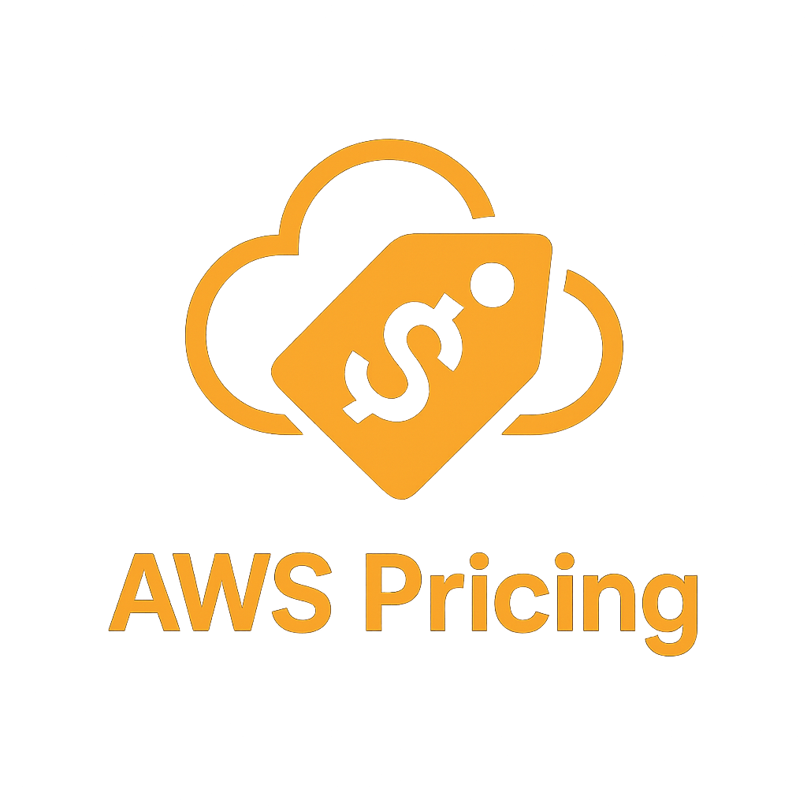

# AWS Pricing Tool 🏷️

English | [中文](README_CN.md)

<p align="center">
  
</p>

<p align="center">
  
  
  
  
  
</p>

> Query real-time AWS pricing for **19 services** × **34 regions** × **6 RI options** with a single command.

```bash
pip3 install boto3
python3 pricing_tool.py --version                                              # v1.5.0
python3 pricing_tool.py --profile <your-profile> query ec2 -t c6g.xlarge -r tokyo
```

---

## Table of Contents

- [Features](#features)
- [AI Skill Integration](#-ai-skill-integration)
- [Quick Start](#quick-start)
- [Command Reference](#command-reference)
- [Supported Regions](#supported-regions-34)
- [Instance Naming Convention](#instance-naming-convention)
- [Tips & Tricks](#tips--tricks)
- [FAQ](#faq)
- [Development](#development)
- [Changelog](#changelog)
- [License](#license)

---

## Features

- 🌏 **34 Regions** — Use Chinese, English, or region codes (`东京` / `tokyo` / `ap-northeast-1`)
- 💰 **7 Price Points** — On-Demand + 6 RI options (1yr/3yr × No/Partial/All Upfront)
- 📊 **4 Commands** — `query` single / `batch` multi-type / `compare` cross-region / `list` types
- 📤 **3 Output Formats** — Colored terminal table / `--json` / `--csv`
- ⚡ **Local Cache** — 7-day TTL, millisecond response on repeat queries
- 🔌 **Importable** — `import pricing_tool` for programmatic use, all functions return structured data
- 🤖 **AI Skill** — Natural language pricing queries with full BOM generation

---

## 🔌 MCP Server (Recommended)

The most powerful integration — works with **all MCP-compatible clients** (Kiro, Claude Code, OpenClaw, Cursor, VS Code, etc.) via a single configuration.

### Install & Run

```bash
pip3 install boto3 fastmcp
python3 mcp_server.py   # Starts MCP server (stdio mode)
```

### Configure Your MCP Client

Add to your MCP client config (e.g. `~/.kiro/settings/mcp.json`, `.claude/settings/mcp.json`, or `openclaw.json`):

```json
{
  "mcpServers": {
    "aws-pricing-tool": {
      "command": "python3",
      "args": ["/your/path/to/mcp_server.py"],
      "env": {
        "AWS_PROFILE": "your-profile"
      }
    }
  }
}
```

### Available MCP Tools (6)

| Tool | Description |
|------|-------------|
| `query_pricing` | Query pricing for a single instance type (OD + 6 RI options) |
| `compare_regions` | Compare same type across multiple regions (★ cheapest) |
| `batch_compare` | Compare multiple types in same region |
| `list_types` | List available instance types (with optional filter) |
| `get_regions` | List all 34 supported regions |
| `get_services` | List all 19 supported services |

### MCP vs AI Skill

| | MCP Server | AI Skill (SKILL.md) |
|---|---|---|
| Integration | Universal (any MCP client) | Platform-specific |
| I/O | Structured JSON | Text parsing |
| Setup | One config for all platforms | One file per platform |
| Tool discovery | Automatic | Manual |

> 💡 **MCP Server is recommended** for new setups. AI Skills (below) remain available for backward compatibility.

---

## 🤖 AI Skill Integration

This tool works as an AI Skill for **Kiro CLI**, **Claude Code**, and **OpenClaw**, turning AI into your AWS pricing consultant — ask in natural language, get complete BOMs.

### 📺 Video Tutorial


### Option A: Kiro CLI

```bash
# 1. Clone & install
git clone https://github.com/neosun100/aws-pricing-tool.git ~/Code/aws-pricing-tool
pip3 install boto3

# 2. Install skill
mkdir -p ~/.kiro/skills/aws-pricing-query
cp ~/Code/aws-pricing-tool/SKILL.md ~/.kiro/skills/aws-pricing-query/SKILL.md

# 3. Edit config (update tool path and AWS profile)
#    Open ~/.kiro/skills/aws-pricing-query/SKILL.md
#    Change: tool path → /your/path/to/pricing_tool.py
#    Change: profile  → --profile your-profile
```

In Kiro, just ask naturally — the skill auto-triggers on pricing keywords:
```
👤 How much is c6g.xlarge in Tokyo?
```

### Option B: Claude Code

```bash
# 1. Clone & install
git clone https://github.com/neosun100/aws-pricing-tool.git ~/Code/aws-pricing-tool
pip3 install boto3

# 2. Install as global slash command
mkdir -p ~/.claude/commands
cp ~/Code/aws-pricing-tool/CLAUDE_COMMAND.md ~/.claude/commands/aws-pricing.md

# 3. Edit config (update tool path and AWS profile)
#    Open ~/.claude/commands/aws-pricing.md
#    Change: tool path → /your/path/to/pricing_tool.py
#    Change: profile  → --profile your-profile
```

In Claude Code, invoke via slash command:
```
/user:aws-pricing How much is c6g.xlarge in Tokyo?
```

### Option C: OpenClaw

```bash
# 1. Clone & install
git clone https://github.com/neosun100/aws-pricing-tool.git ~/Code/aws-pricing-tool
pip3 install boto3

# 2. Install skill
cp -r ~/Code/aws-pricing-tool/openclaw-skill ~/.openclaw/skills/aws-pricing-query

# 3. Edit config (update tool path and AWS profile)
#    Open ~/.openclaw/skills/aws-pricing-query/skill.md
#    Change: tool path → /your/path/to/pricing_tool.py
#    Change: profile  → --profile your-profile
#    Also update TOOL_PATH and AWS_PROFILE in index.js
```

In OpenClaw, just ask naturally:
```
👤 How much is c6g.xlarge in Tokyo?
```

### Post-Install Configuration

After installing on any platform, edit the config file and update these two lines:

```yaml
tool:    /your/path/to/pricing_tool.py   # ← your actual path
profile: --profile <your-profile>        # ← your AWS profile
```

### Natural Language Examples

```
👤 c6g.xlarge in Tokyo?
🤖 → EC2 pricing: OD + 6 RI options, with Graviton recommendation

👤 2x Aurora MySQL db.r6g.xlarge Tokyo Multi-AZ 500GB
🤖 → Full BOM: instance + storage + I/O + backup + data transfer

👤 Architecture: 2x c6in.4xlarge + Aurora db.r6g.xlarge + Redis cache.r6g.large Tokyo
🤖 → Multi-service BOM with optimization suggestions

👤 Compare c6g.xlarge across Tokyo and Virginia
🤖 → Cross-region comparison, ★ marks cheapest

👤 S3 10TB Standard, 1M GET/month
🤖 → Usage-based calculation (built-in formulas, no API needed)

👤 When does RI break even?
🤖 → Break-even analysis + Savings Plans comparison
```

### Skill Coverage

| Type | Count | Method |
|------|-------|--------|
| Instance-based | 19 services | Price List API (real-time) |
| Usage-based | 15+ services | Built-in formulas (S3/Lambda/DynamoDB/CloudFront etc.) |

Full capabilities: complete BOM, Graviton recommendations, RI break-even analysis, hidden cost alerts, architecture mode, export to Markdown.

### Skill Files

| File | Platform | Description |
|------|----------|-------------|
| `SKILL.md` | Kiro CLI | YAML frontmatter with trigger keywords, auto-matches |
| `CLAUDE_COMMAND.md` | Claude Code | `$ARGUMENTS` placeholder, invoked via `/user:aws-pricing` |
| `openclaw-skill/` | OpenClaw | `skill.md` + `index.js`, installed to `~/.openclaw/skills/` |

All files share the same core content (parameter checklists, interaction strategies, reference pricing, BOM templates, optimization advice).

---

## Quick Start

### 1. Install

```bash
git clone https://github.com/neosun100/aws-pricing-tool.git && cd aws-pricing-tool
pip3 install boto3
python3 pricing_tool.py --help
```

### 2. Configure AWS Credentials

```bash
# Option A: AWS Profile (recommended)
aws configure --profile my-profile

# Option B: SSO
aws sso login --profile my-profile

# Option C: Environment variables
export AWS_ACCESS_KEY_ID=<key>
export AWS_SECRET_ACCESS_KEY=<secret>
```

Minimum IAM permissions:
```json
{
  "Version": "2012-10-17",
  "Statement": [{
    "Effect": "Allow",
    "Action": ["pricing:GetProducts", "pricing:GetAttributeValues", "pricing:DescribeServices"],
    "Resource": "*"
  }]
}
```

### 3. Query Pricing

```bash
python3 pricing_tool.py --profile p query ec2 -t c6g.xlarge -r tokyo
python3 pricing_tool.py --profile p query rds -t db.r6g.xlarge -r singapore -e aurora-mysql
python3 pricing_tool.py --profile p compare ec2 -t c6g.xlarge -r "tokyo,singapore,virginia"
```

---

## Command Reference

### `query` — Single Instance Pricing

```bash
python3 pricing_tool.py --profile <p> query <service> -t <type> -r <region> \
    [-e engine] [-d Multi-AZ] [--os Windows] [--json] [--csv]
```

**All 19 services:**

| Category | Service | Example |
|----------|---------|---------|
| Compute | `ec2` | `query ec2 -t c6g.xlarge -r tokyo` |
| Compute | `ec2` (Windows) | `query ec2 -t m6i.xlarge -r tokyo --os Windows` |
| Database | `rds` (Aurora) | `query rds -t db.r6g.xlarge -r tokyo -e aurora-mysql` |
| Database | `rds` (Multi-AZ) | `query rds -t db.r6g.large -r tokyo -e mysql -d Multi-AZ` |
| Cache | `elasticache` | `query elasticache -t cache.r6g.large -r tokyo -e redis` |
| Search | `opensearch` | `query opensearch -t m6g.large.search -r tokyo` |
| Data Warehouse | `redshift` | `query redshift -t ra3.xlplus -r tokyo` |
| Graph DB | `neptune` | `query neptune -t db.r6g.large -r tokyo` |
| Document DB | `docdb` | `query docdb -t db.r6g.large -r tokyo` |
| In-Memory DB | `memorydb` | `query memorydb -t db.r6g.large -r tokyo` |
| Message Queue | `mq` ⚠️ | `query mq -t m5.large -r tokyo` |
| Cache Accel. | `dax` ⚠️ | `query dax -t r5.large -r tokyo` |
| ML | `sagemaker` | `query sagemaker -t ml.m5.xlarge -r tokyo` |
| Big Data | `emr` ⚠️ | `query emr -t m6g.xlarge -r tokyo` |
| Gaming | `gamelift` | `query gamelift -t c5.large -r tokyo` |
| Streaming | `appstream` | `query appstream -t stream.standard.large -r tokyo` |
| Desktop | `workspaces` | `query workspaces -t c5.xlarge -r tokyo` |
| Container | `ecs` | `query ecs -t t3.medium -r tokyo` |
| Container | `eks` | `query eks -t t3.medium -r tokyo` |
| VMware | `evs` | `query evs -t i4i.metal -r tokyo` |

> ⚠️ MQ / DAX / EMR instance types have **no service prefix** — use `m5.large` not `mq.m5.large`

### `batch` — Compare Multiple Types in Same Region

```bash
python3 pricing_tool.py --profile p batch ec2 -t "c6g.xlarge,c6g.2xlarge,c6g.4xlarge" -r tokyo
python3 pricing_tool.py --profile p batch ec2 -t "c6g.xlarge,c6g.2xlarge" -r tokyo --json
```

### `compare` — Cross-Region Comparison (★ marks cheapest)

```bash
python3 pricing_tool.py --profile p compare ec2 -t c6in.4xlarge -r "tokyo,singapore,virginia,frankfurt"
python3 pricing_tool.py --profile p compare ec2 -t c6g.xlarge -r "tokyo,virginia" --csv
```

### `list` — List Available Instance Types for a Region

```bash
python3 pricing_tool.py --profile p list ec2 -r tokyo -f c6g
python3 pricing_tool.py --profile p list rds -r tokyo -f db.r6g --json
```

> `list` returns region-specific instance types (via `GetProducts` API), not a global list.

### Cache Management

```bash
python3 pricing_tool.py cache-info                    # View cache status
python3 pricing_tool.py refresh                       # Clear all cache
python3 pricing_tool.py --no-cache query ec2 -t ...   # Skip cache once
```

### `regions` — List All Supported Regions

```bash
python3 pricing_tool.py regions                       # Table output
python3 pricing_tool.py regions --json                # JSON output
```

### Output Formats

All query commands (`query`, `batch`, `compare`, `list`) support:

| Format | Flag | Use Case |
|--------|------|----------|
| Colored table | _(default)_ | Terminal reading, auto-detects TTY |
| JSON | `--json` | Programmatic parsing, AI Skill integration |
| CSV | `--csv` | Import to Excel / Google Sheets |

```bash
python3 pricing_tool.py --profile p query ec2 -t c6g.xlarge -r tokyo --json
python3 pricing_tool.py --profile p compare ec2 -t c6g.xlarge -r "tokyo,virginia" --csv
python3 pricing_tool.py --version
```

---

## Supported Regions (34)

Supports Chinese aliases, English aliases, and standard region codes. Case-insensitive.

| Chinese | English | Code | | Chinese | English | Code |
|:---:|:---:|:---:|---|:---:|:---:|:---:|
| 弗吉尼亚 | virginia | us-east-1 | | 东京 | tokyo | ap-northeast-1 |
| 俄亥俄 | ohio | us-east-2 | | 首尔 | seoul | ap-northeast-2 |
| 加利福尼亚 | california | us-west-1 | | 大阪 | osaka | ap-northeast-3 |
| 俄勒冈 | oregon | us-west-2 | | 新加坡 | singapore | ap-southeast-1 |
| 加拿大 | canada | ca-central-1 | | 悉尼 | sydney | ap-southeast-2 |
| 卡尔加里 | calgary | ca-west-1 | | 雅加达 | jakarta | ap-southeast-3 |
| 圣保罗 | saopaulo | sa-east-1 | | 墨尔本 | melbourne | ap-southeast-4 |
| 墨西哥 | mexico | mx-central-1 | | 马来西亚 | malaysia | ap-southeast-5 |
| 法兰克福 | frankfurt | eu-central-1 | | 泰国 | thailand | ap-southeast-6 |
| 苏黎世 | zurich | eu-central-2 | | 新西兰 | newzealand | ap-southeast-7 |
| 爱尔兰 | ireland | eu-west-1 | | 香港 | hongkong | ap-east-1 |
| 伦敦 | london | eu-west-2 | | 台北 | taipei | ap-east-2 |
| 巴黎 | paris | eu-west-3 | | 孟买 | mumbai | ap-south-1 |
| 米兰 | milan | eu-south-1 | | 海得拉巴 | hyderabad | ap-south-2 |
| 西班牙 | spain | eu-south-2 | | 巴林 | bahrain | me-south-1 |
| 斯德哥尔摩 | stockholm | eu-north-1 | | 阿联酋 | uae | me-central-1 |
| 开普敦 | capetown | af-south-1 | | 特拉维夫 | telaviv | il-central-1 |

---

## Instance Naming Convention

```
c6in.4xlarge
│││  └── Size: nano < micro < small < medium < large < xlarge < 2xlarge < ... < metal
││└── Attributes: n=network  g=Graviton(ARM)  a=AMD  i=Intel  d=local-SSD
│└── Generation: 5/6/7 (newer = cheaper)
└── Family: c=compute  m=general  r=memory  t=burstable  i=storage  p/g=GPU
```

**Prefix rules:**

| Service | Prefix | Example |
|---------|--------|---------|
| EC2 / GameLift / AppStream / ECS / EKS / EVS | none | `c6g.xlarge` |
| RDS / Neptune / DocDB | `db.` | `db.r6g.xlarge` |
| ElastiCache | `cache.` | `cache.r6g.large` |
| OpenSearch | suffix `.search` | `m6g.large.search` |
| SageMaker | `ml.` | `ml.m5.xlarge` |
| MQ / DAX / EMR ⚠️ | none | `m5.large` |

---

## Tips & Tricks

```bash
# Graviton vs x86 comparison (ARM is typically 20% cheaper)
python3 pricing_tool.py --profile p batch ec2 -t "c6i.4xlarge,c6g.4xlarge" -r tokyo

# Find the cheapest region
python3 pricing_tool.py --profile p compare ec2 -t c6g.xlarge \
    -r "virginia,ireland,tokyo,singapore,mumbai"

# JSON output → jq processing
python3 pricing_tool.py --profile p query ec2 -t c6g.xlarge -r tokyo --json | jq '.[] | .price_per_hour'

# CSV output → Excel
python3 pricing_tool.py --profile p compare ec2 -t c6g.xlarge \
    -r "tokyo,singapore,virginia" --csv > compare.csv

# Programmatic usage
python3 -c "
from pricing_tool import get_client, query_products, extract_pricing, build_filters, SERVICE_CODES
from types import SimpleNamespace
args = SimpleNamespace(region='ap-northeast-1', instance_type='c6g.xlarge', os='Linux',
                       engine=None, deployment=None)
client = get_client('my-profile')
products = query_products(client, SERVICE_CODES['ec2'], build_filters('ec2', args))
for p in products:
    r = extract_pricing(p)
    if r.get('price_per_hour'):
        print(f'{r[\"instance_type\"]}: \${r[\"price_per_hour\"]:.4f}/hr')
"
```

---

## FAQ

| Problem | Solution |
|---------|----------|
| Credentials expired | `aws sso login --profile <p>` to re-authenticate |
| Instance type not found | Use `list` to check availability; note MQ/DAX/EMR have no prefix |
| Price mismatch | Verify Region / OS / deployment mode (Single-AZ vs Multi-AZ); use `--no-cache` |
| Spot pricing | Not supported; use `aws ec2 describe-spot-price-history --instance-types ...` |
| Cache too large | `python3 pricing_tool.py refresh` to clear all cache |

---

## Development

### Project Structure

```
aws-pricing-tool/
├── pricing_tool.py    # Main program (single file, standalone)
├── mcp_server.py      # MCP Server (6 tools, works with all MCP clients)
├── SKILL.md           # Kiro Skill definition (template)
├── CLAUDE_COMMAND.md  # Claude Code slash command (template)
├── openclaw-skill/    # OpenClaw skill (skill.md + index.js)
│   ├── skill.md       # OpenClaw skill specification
│   └── index.js       # OpenClaw skill entry point
├── conftest.py        # Test fixtures (mock AWS API responses)
├── test_unit.py       # Unit tests (66)
├── test_e2e.py        # End-to-end tests (27)
├── test_mcp.py        # MCP Server tests (20)
├── logo.png           # Project logo
├── README.md          # This document (English)
├── README_CN.md       # Chinese documentation
└── .gitignore
```

### Running Tests

```bash
pip3 install pytest
python3 -m pytest -v                    # Run all 93 tests
python3 -m pytest test_unit.py -v       # Unit tests only
python3 -m pytest test_e2e.py -v        # E2E tests only
python3 -m pytest -k "extract_pricing"  # Filter by name
```

Test coverage:

| File | Tests | Coverage |
|------|-------|----------|
| `test_unit.py` | 66 | Region resolution, cache R/W, pricing extraction (OD + 6 RI), dedup/sort, formatting, 19 service filters, JSON/CSV output, color |
| `test_e2e.py` | 27 | CLI arg parsing, --version/--help, query/batch/compare/list JSON/CSV/table output, cache commands, error handling |

E2E tests invoke the real CLI via subprocess with a mock runner injecting simulated API responses — no AWS credentials needed.

### Tech Stack

- Python 3.8+ (no dependencies beyond `boto3`)
- AWS Price List API (`us-east-1` endpoint)
- Local JSON file cache (`~/.cache/aws-pricing/`, 7-day TTL)

---

## Changelog

| Version | Date | Changes |
|---------|------|---------|
| v1.5.0 | 2025-03-13 | MCP Server (`mcp_server.py`) with 6 tools; works with Kiro/Claude Code/OpenClaw/Cursor/VS Code; 113 tests (20 MCP + 93 original) |
| v1.3.0 | 2025-03-12 | OpenClaw skill support (`openclaw-skill/`); 3-platform AI Skill (Kiro + Claude Code + OpenClaw); `.gitignore` hardened for sensitive files |
| v1.2.0 | 2025-02-27 | `--json`/`--csv` on all commands; colored terminal output; region-specific `list`; `--version`; 19 service filters; 3yr_No_Upfront RI fix; `regions` command; 93 tests |
| v1.0.0 | 2025-02-25 | Initial release: 19 services × 34 regions, query/batch/compare/list, local cache |

---

## License

MIT
